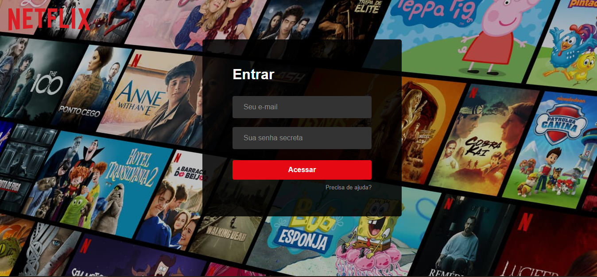

    
    <h1 align="center">
        NetFlix Clone
    </h1>

  <a href="#tecnologias">Tecnologias</a>&nbsp;&nbsp;&nbsp;|&nbsp;&nbsp;&nbsp;
  <a href="#projeto">Projeto</a>&nbsp;&nbsp;&nbsp;|&nbsp;&nbsp;&nbsp;
  <a href="#layout">Layout</a>&nbsp;&nbsp;&nbsp;|&nbsp;&nbsp;&nbsp;
  <a href="#como-contribuir">Como contribuir</a>&nbsp;&nbsp;&nbsp;|&nbsp;&nbsp;&nbsp;
  <a href="#memo-licença">Licença</a>

## 🚀 Tecnologias

Esse projeto foi desenvolvido com as seguintes tecnologias:
- [React](https://reactjs.org)
- Styled-components

## 💻 Projeto

O NetFlixClone é totalmente educacional e foi desenvolvido como parte do curso online da empresa B7Web.
Visa clonar a interface do NetFlix e eu adicionei o sistema de usuários.

## Acesso
Email:  admin@netflixclone.com.br  
Senha:  netflixclone

## Layout

    
Pagina de Login

    
     
    
Pagina Home

    

